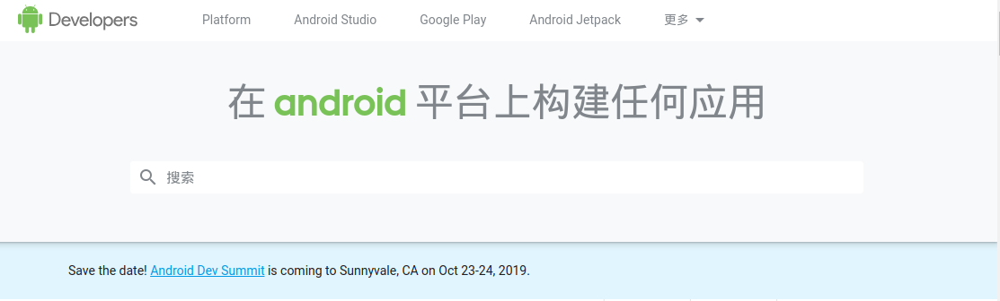
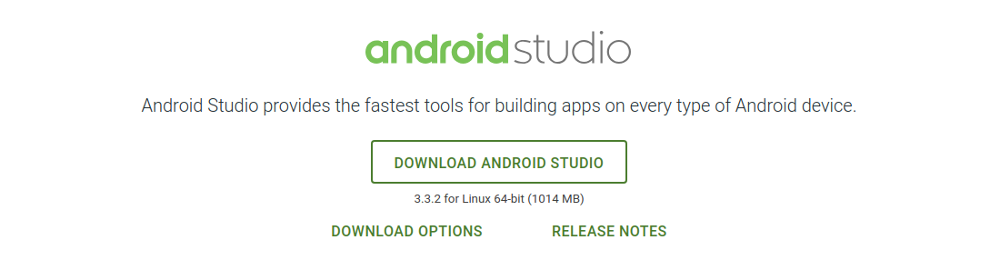
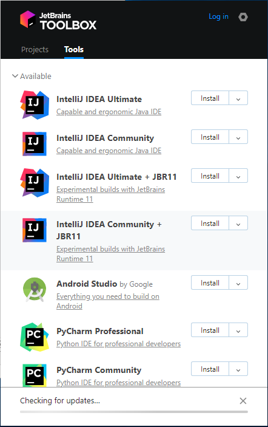
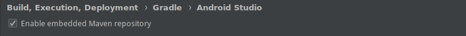
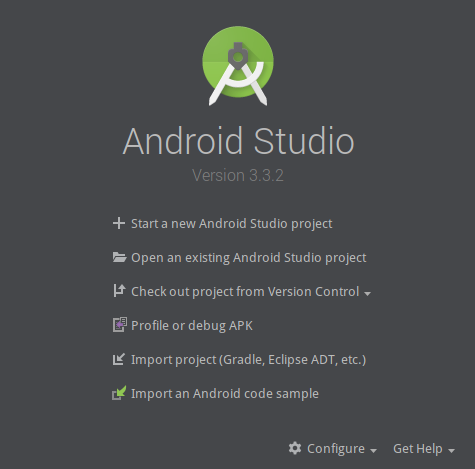
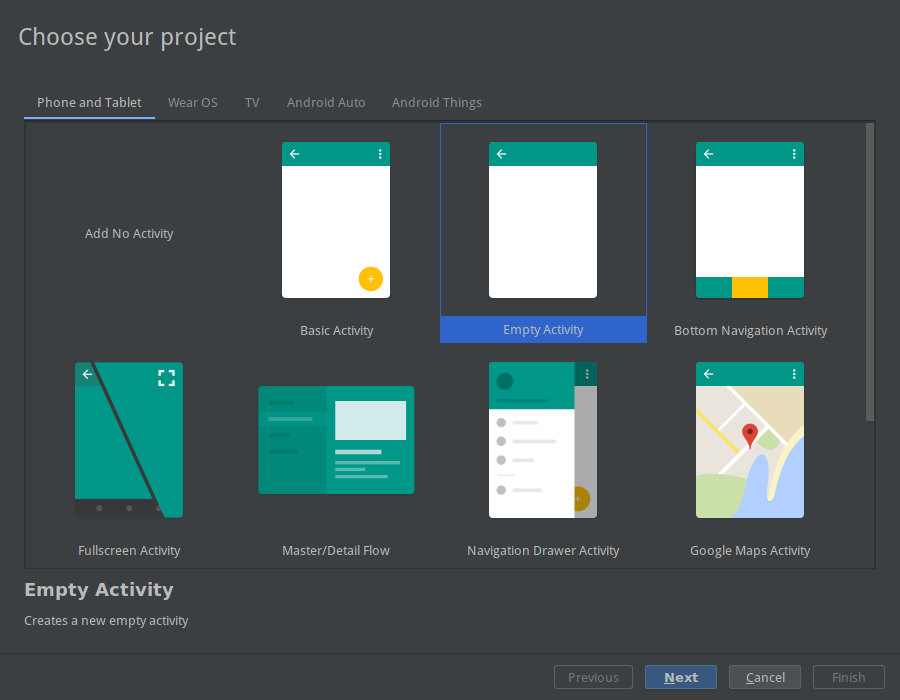
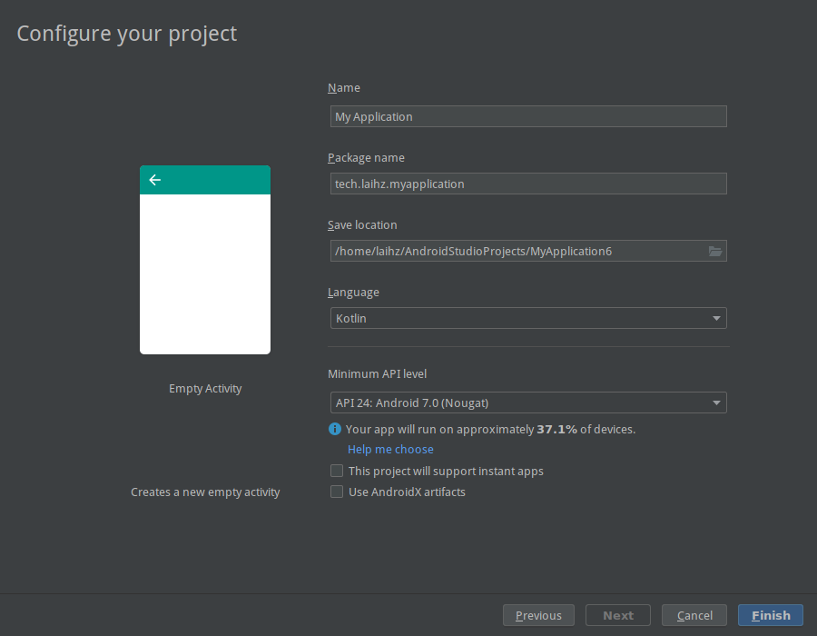

# 第一章 Android Studio的安装 & Hello World 

-------------

## Android Studio的安装
### 从[Android Developers](https://developer.android.google.cn/)官网下载
  * [Android Developers](https://developer.android.google.cn/)官网
  
  
  * 下载Android Studio二进制文件
  
  
### 通过[JetBrains](https://www.jetbrains.com/)的[Toolbox](https://www.jetbrains.com/toolbox/)下载最新版本的Android Studio（推荐方式）
  *  安装后界面
  
  

-------------
## Android Studio的配置
### 添加国内镜像（由于某些原因导致的下载速度慢）
#### 开启嵌入式Maven仓库
Settings -> Build,Execution,Deployment -> Gradle -> Android studio 


#### 添加国内镜像网站
* 在用户目录创建.gradle目录并新建```init.gradle```文件
  > Linux
  > ```mkdir /Home/<Your Name>/.gradle```
  > ```touch init.gradle ```
  
  > Windows
  > windows在新建项目后退出在```C:/User/<Your Name>/.gradle```文件夹中新建init.gradle文本文件
* 在```init.gradle```中添加国内镜像：
  ```
  allprojects{
    repositories {
        def ALIYUN_REPOSITORY_URL = 'http://maven.aliyun.com/nexus/content/groups/public'
        def ALIYUN_JCENTER_URL = 'http://maven.aliyun.com/nexus/content/repositories/jcenter'
        all { ArtifactRepository repo ->
            if(repo instanceof MavenArtifactRepository){
                def url = repo.url.toString()
                if (url.startsWith('https://repo1.maven.org/maven2')) {
                    project.logger.lifecycle "Repository ${repo.url} replaced by $ALIYUN_REPOSITORY_URL."
                    remove repo
                }
                if (url.startsWith('https://jcenter.bintray.com/')) {
                    project.logger.lifecycle "Repository ${repo.url} replaced by $ALIYUN_JCENTER_URL."
                    remove repo
                }
            }
        }
        maven {
            url ALIYUN_REPOSITORY_URL
            url ALIYUN_JCENTER_URL
        }
    }

  ```

## Hello World的创建
* 打开Android Studio

    
* 选择Start a new Android Studio project

    
* 点击下一步（next）
    
    
> 填写项目名称```Name```（首字母大写）
> 填写包名```Package name```以及选择保存路径
> 语言```language```我们选择Kotlin
> 选择你的最低API等级```Minimum API level```
> 点击结束 ```finish```

至此你的Hello World 项目就创建成功了

* 等待项目构建完成
    * 去喝一杯咖啡等待构建完成！
* 构建完成后可以看到有两个主要的页面，```activity_main.xml```和```MainActivity.kt```

我们主要使用设计器来控制和添加```activity_main.xml```中的内容，也可以直接在Android Studio靠左下角的位置选择text来手动编写代码

在```MainActivity.kt```中，我们实现软件的逻辑功能


